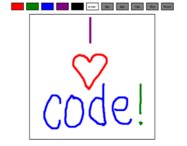

# Draw Together

## Overview
* A collaborative drawing app where multiple people on different devices can draw on the same canvas at the same time.




### Technologies, frameworks, & programming Languages used
* HTML5 & CSS3
* Canvas
* JavaScript
* jQuery
* Node.js
* Express
* Socket.io


### NPMs to install

```node
$ npm install express --save
$ npm install socket.io --save
```


### Url to live demo

[Check it out](https://draw-together-duhowphuwa.now.sh/)
